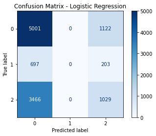
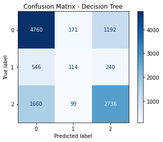
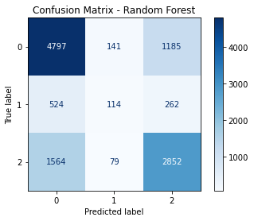

# Overview
This project focuses on predicting the functionality of water pumps in Tanzania using a large dataset provided by Taarifa and the Tanzanian Ministry of Water. The goal is to assist NGOs and the Tanzanian government in identifying critical factors that influence pump functionality, enabling them to make informed decisions on maintenance and new installations.

# Business & Data Understanding
### Stakeholders
- Non-Governmental Organizations (NGOs): Involved in providing support for well repairs across Tanzania.
- Government of Tanzania (Ministry of Water): Seeks to understand patterns in non-functional wells to improve the planning and construction of new water points.

### Data Overview
- The dataset comprises 59,400 water points, making it robust for training predictive models.
- Features include numerical, categorical, and geographical data, providing a comprehensive view of factors affecting pump functionality.
- The primary target variable is status_group, which categorizes pumps as either functional, non-functional, or functional but needing repairs.

### Target Variable Distribution
   - **Functional Pumps:** 54.3% (32,259)
   - **Non-Functional Pumps:** 38.4% (22,824)
   - **Functional but Needs Repair:** 7.3% (4,317)

   **Insight:** A significant portion of pumps are non-functional or require repairs, highlighting the importance of early maintenance intervention.

### Funding Insights
   - **Average Funding (`amount_tsh`):**
     - Functional pumps: 461.80 Tsh
     - Functional but needs repair: 267.07 Tsh
     - Non-functional pumps: 123.48 Tsh

   **Insight:** Better-funded pumps are more likely to be functional, while lower-funded pumps are at a higher risk of failure.

# Modeling & Evaluation
I chose three models: a Logistic Regression model, then a decision tree model and then finally random forest tree.
### Logistic Regression Model

- I used the logistic regression model as my baseline model.
- In the model I realized that it is evident that class 1(functional that needs repair) pumps is performing poorly on my model based on the precision, recall and F1-score being 0.
- This may be because that the class is being underrepresented thus the model is not learning enough about it.

### Decision Tree Model

- Decision Tree outperforms Logistic Regression in terms of accuracy.
- The model also performs slightly better with predicting class 1 (functional that needs repair) with a precision of 30% and a recall of 13% as compared to Logistic Regression both of which scored 0%

### Random Forest Model

- Random Forest has the highest accuracy of (0.6740), which indicates better overall performance in predicting the target variable.
- Random Forest also has the best performance in precision, recall and F1-score.

